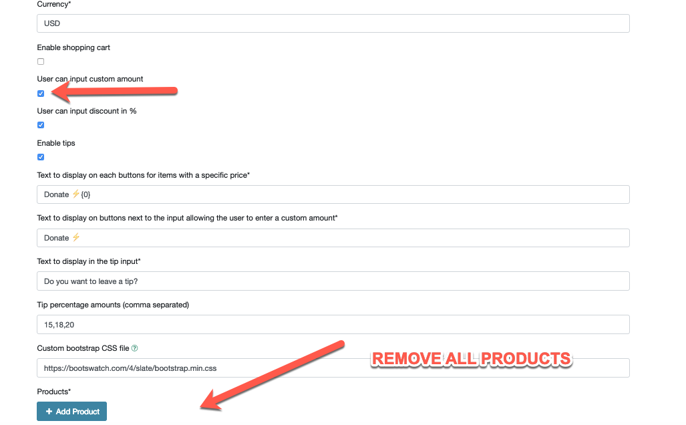
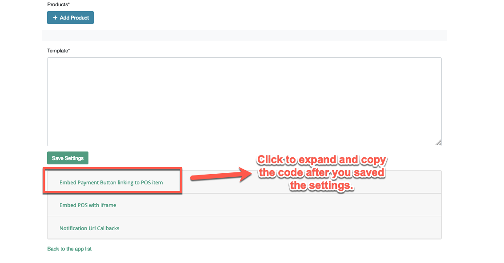
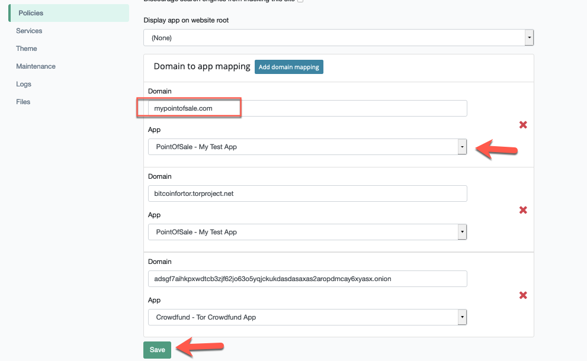
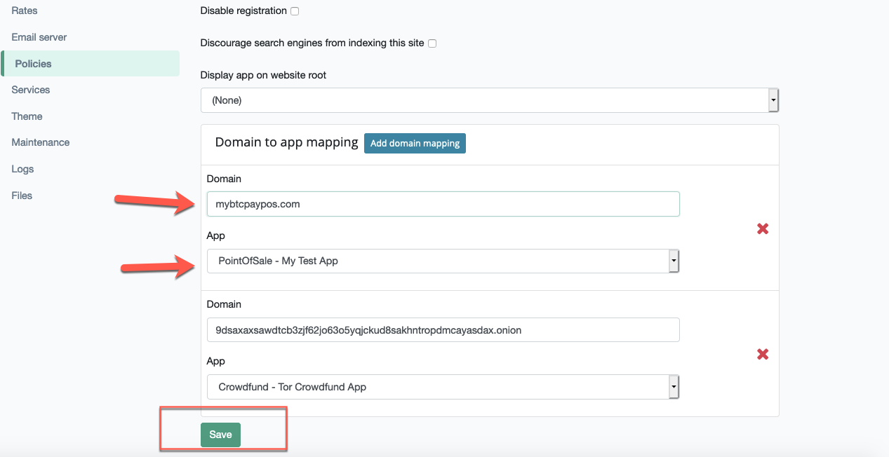

# BTCPay Apps Frequently Asked Questions

This document covers frequently asked questions about the Apps in BTCPay.

* [What are the Apps in BTCPay?](#what-are-the-apps-in-btcpay)
* [Is there a limit on the number of Apps I can deploy?](#is-there-a-limit-on-the-number-of-apps-i-can-deploy)
* [Is there a Point of Sale feature in BTCPay?](#is-there-a-point-of-sale-feature-in-btcpay)
* [How can I use BTCPay in a physical store?](#how-can-i-use-btcpay-in-a-physical-store)
* [How to customize the appearance of Point of Sale App in BTCPay?](#how-to-customize-the-appearance-of-point-of-sale-app-in-btcpay)
* [What is a Payment Button?](#what-is-a-payment-button)
* [How to fix empty spacing around payment button](#how-to-fix-empty-spacing-around-payment-button)
* [How to integrate WooCommerce Store in BTCPay Crowdfund app?](#how-to-integrate-woocommerce-store-into-a-btcpay-crowdfund-app)
* [How to create Pay button with a custom amount?](#how-to-create-pay-button-with-a-custom-amount)
* [How to map a domain name to an app?](#how-to-map-a-domain-name-to-an-app)

## What are the Apps in BTCPay?
Apps are plugins (features) you can use to expand the use case of your BTCPay.

## Is there a limit on the number of Apps I can deploy?
There's no limit. Each app can be created an unlimited amount of times. Apps are added on a store level; you need to have a store to create an app.

## Is there a Point of Sale feature in BTCPay?
Yes. Please read our [guide on creating the POS app](/WhatsNext.md#creating-the-pay-button).

## How can I use BTCPay in a physical store?
You can use our Point of Sale app. For having a physical PoS, right now, the easiest solution is to utilize PoS App that’s available and then set that as URL within your in-store POS. When you create POS app within BTCPay Server - you will get publicly accessible URL where checkout buttons for products you’ve defined will be displayed. Click on the button creates an invoice.

Please follow our detailed guide on how to use our [PoS App on a mobile device.](https://blog.btcpayserver.org/bitcoin-pos/)

## How to customize the appearance of Point of Sale App in BTCPay
It is very easy to customize the look of the Point of Sale app. [Follow this guide](/Theme.md) to learn how to change the theme.

## What is a Payment Button?
The Payment Button is a simple and customizable HTML button you can create and embed into your website. To create a payment button, [follow this guide](/WhatsNext.md#creating-the-point-of-sale-app)

## How to fix empty spacing around payment button?
This usually happens in Wordpress. The Wordpress text editor can cause conflicts with the pay button code by adding `<br>`, which is "line break" in HTML, between the hidden lines of the form, thus adding invisible empty lines.

You can get rid of that with a simple Wordpress plugin, [Don't muck my markup](https://wordpress.org/plugins/dont-muck-my-markup/). Install, activate it, and then you should see this box on the right of the edit page of your posts :


Just tick the case in the post you want to stick the pay button in, and the problem should be solved.

If the same problem occurs with other CMS, please check that the text editor does not add `<br>` tag automatically in the HTML code of your post.

## How to integrate WooCommerce Store into a BTCPay Crowdfund app?
If you want to provide a way for your backers to receive digital files and physical products, you can embed WooCommerce store into your Crowdfunding app.


The following tutorial assumes you have a semi-advanced understanding of BTCPay, WordPress and WooCommerce.

### Requirements
1. Wordpress Website
2. [WooCommerce Plugin](https://wordpress.org/plugins/woocommerce/)
3. [BTCPay for WooCommerce Plugin](https://wordpress.org/plugins/btcpay-for-woocommerce/)
4. [Storefront Theme](https://wordpress.org/themes/storefront/) (if you're using another theme, you may need to modify the CSS code to fit your theme.
5. BTCPay Server

**Important Note**  Make sure that both your WooCommerce store and BTCPay Server **are on a same domain**. Some browsers have aggressive way of blocking the cross-domain embeded content. Quite specifically, Safari on iOS will destroy the cookie when the item is added, which will leaad to empty cart. There's no other way to fix this besides having BTCPay and Woo on a same domain as subdomains at least.

#### Optional WordPress Plugins
The following plugins are recommended, but not required. You don't have to use them if you're an advanced WordPress user.
* [Flexible Checkout Fields](https://wordpress.org/plugins/flexible-checkout-fields/) (to edit checkout and remove redundant checkout fields in Woo)
* [WooCommerce Direct Checkout](https://wordpress.org/plugins/woocommerce-direct-checkout/) (remove redundant steps in the checkout process and make pledging quicker)
* [Header and Footer Scripts](https://wordpress.org/plugins/header-and-footer-scripts/) (place `<script>` code here)

### Instructions

#### 1. Connecting two stores to a single wallet

In your BTCPay Server, create two separate stores:
1. Store for WooCommerce
2. Store for Crowdfunding app

Add the **same xpub derivation scheme**, so that both stores remain in sync.

#### 2. Modifying CSS in WordPress
In the first step, you need to remove all the redundancies from the WordPress store and make it clean and simple, so that it embeds smoothly into the crowdfund app.

Place the following custom CSS code into WordPress. Appearance > Customize > **Custom CSS**

```css
#masthead {
	display: none;
}

.site-footer {
display: none;
}

.storefront-breadcrumb {
	display: none;
}

.storefront-sorting {
	display: none;
}

.woocommerce-products-header {
	display: none;
}

.woocommerce-additional-fields{
	display: none;
}

.woocommerce-form-coupon-toggle {
	display: none;
}

.storefront-product-section .section-title {
   display: none;
}
.site-footer {
   display: none;
}

#masthead {
   display: none;
}
#header {
   display: none;
}

.woocommerce-breadcrumb  {  display: none;
}

.related.products {
   display: none;
}

.storefront-breadcrumb {
   display: none;
}

.storefront-sorting {
   display: none;
}

.woocommerce-products-header {display: none;}

.iframe {
 overflow: hidden;
}

ul.products li.product .button {
    margin-bottom: .236em;
    display: block;
}

.woocommerce-additional-fields {
   display: none;
}

#masthead {
    display: none;
}
.site-footer {
display: none;
}
.storefront-breadcrumb {
    display: none;
}
.storefront-sorting {
    display: none;
}
.woocommerce-products-header {
    display: none;
}
.woocommerce-additional-fields{
    display: none;
}
.woocommerce-form-coupon-toggle {
    display: none;
}

.product:hover{
background-color:rgba(0,0,255,0.3);
color:rgba(0,0,0,0);
padding-bottom:45px;
}
.product:hover a *{
visibility:hidden;
}
.product:hover a.add_to_cart_button{
    position: absolute;
    top: 0;
    left: 0px;
    width: 100%;
    height: 100%;
    padding-top: 50%;
    color: white;
background-color:rgba(0,0,255,0.3);

}

.product:hover a.add_to_cart_button:hover{

background-color:rgba(0,0,255,0.5);
}

```
The code above removes and hides all the unnecessary things from your store (headers, footers, breadcrumbs, and sorting). If you're not using the Storefront theme, you may need to modify it slightly. Besides removing, the bottom part of the code adds a bit of different styling which improves the checkout experience and makes it more KickStarter like. Feel free to modify colors. You should also remove the sidebar.

To remove the redundant fields in WooCommerce checkout, use [Flexible Checkout Fields](https://wordpress.org/plugins/flexible-checkout-fields/).

To speed up the checkout process use [WooCommerce Direct Checkout](https://wordpress.org/plugins/woocommerce-direct-checkout/) (remove redundant steps in the checkout process and make pledging quicker)

#### 2. Modifing WordPress functions

Insert the following code at the bottom of your child theme's **functions.php** file.

```php
* Code goes in theme functions.php.
*/
add_action( 'after_setup_theme', 'wc_remove_frame_options_header', 11 );
/**
* Allow rendering of checkout and account pages in iframes.
*/
function wc_remove_frame_options_header() {
    remove_action( 'template_redirect', 'wc_send_frame_options_header' );
}
```
If you add the php code directly into Appearance>Editor>functions.php, next time you update the theme, the changes will be wiped. So, use either use a custom function plugin of some sort, or [create a child theme](https://docs.woocommerce.com/document/set-up-and-use-a-child-theme/) and always place the code at the bottom.

#### 3. Adding script to WordPress
Install [Header and Footer Scripts](https://wordpress.org/plugins/header-and-footer-scripts/) plugin. Add the followig code to your header or footer. Settings > Headers and Footers Script, paste the code and save changes.
```js
<script>
jQuery( document ).ready(function() {
    jQuery(".product").each(function(){
        var product = jQuery(this);
        var item = product.find(".woocommerce-loop-product__link");
        var cartLink = product.find(".add_to_cart_button").attr("href");
        item.attr("href", cartLink);
    });
});
</script>
```
This piece of code makes sure that each click on the product area adds it to cart and prevents users from viewing product description, which is completely uncecessary for our use-case.

#### 4. Modifying the Crowdfunding app
In your BTCPay, Apps > Create New App > Crowdfunding.

In the description of your app, toggle the code and paste the following code and add `<iframe src="http://yourdomain/shop/"></iframe>`
Replace it with the URL of your WooCommerce Store page.


Next, paste the following code into the **Custom CSS Code** section of your crowdfunding app:
```css
#crowdfund-body-header-tagline-container,
#crowdfund-body-description-container {
    max-width: 100% !important;
    width: 100% !important;
    flex: 100%;
}

#crowdfund-body-contribution-container {
    display: none;
}

#crowdfund-body-header-cta {
    display: none;
}

#crowdfund-body-description-container iframe {
    width:100%;
    border:0;
    min-height:500px;
}
/* // Medium devices (tablets, 768px and up) */
@media (min-width: 768px) {
    #crowdfund-body-description-container{
        padding-right: 30%;
        min-height:1200px;
    }
    #crowdfund-body-description-container iframe {
        width:30%;
        position: absolute;
        right: 0;
        top:0;
        height: 100%;
        border-left: 1px #e5e5e5 solid;
    }
}
```

One final thing, make sure to check (enable) **Count all invoices created on the store as part of the crowdfunding goal**
Save the changes and preview the app.

## How to create Pay button with a custom amount?

BTCPay Pay Button which can be found in Store Settings > Pay Button, currently does not support custom amounts.
However, you can use a work-around:
* [Create Point of sale app](/WhatsNext.md#creating-the-point-of-sale-app)
* Enable `user can input a custom amount` field
* Remove all the products from the automatically generated template.
* Save settings.
* Click on the `Embed payment button linking to PoS item` at the bottom of the page and copy the expanded code. Paste it into html page of your website.
* Remove the extra fields you do not need, especially `<input name="price" type="hidden" value="10" />` so that button redirects to the point of sale.




## How to map a domain name to an app?
BTCPay Apps can have a domain name that's different from the servers domain. Let's assume you have BTCPay server at mybtcpayserver.com and want to display your PoS app on mybtcpaypos.com instead mybtcpayserver.com/apps/pos/abc123
First, [configure DNS settings](/ChangeDomain.md#setting-up-your-dns-record) of mypointofsale.com and make sure it's pointing to the external ip of your BTCPay Server.

Next, add additional domain or subdomain name(s) by adding a new enviroment variable through ssh:

```bash
sudo su -
export BTCPAY_ADDITIONAL_HOSTS="mybtcpaypos.com"
. btcpay-setup.sh -i
```
If you want to add multiple domains, you just need to update the env variables again
```bash
sudo su -
export BTCPAY_ADDITIONAL_HOSTS="mybtcpaypos.com,subdomain.domain2.com,domain3.com"
. btcpay-setup.sh -i
```
Finally, in Server Settings > Policies click on the `Map specific domains to specific apps`



Enter domain name, select a previously created app from the drop down menu and click `save` to map the app to specific domain.



If any of the additionally added hosts do not have a properly configured DNS, Let's Encrypt will not be able to renew the certificate for any of the domains, including the main domain. If you're using additional hosts and facing https issues with the main domain, try removing a domain from the `BTCPAY_ADDITIONAL_HOSTS` and re-run the setup. The https issue also occurs if [Dynamic DNS](/DynamicDNS.md) has not been renewed and is configured as an additional host.

If for any reason, you want an app to be on the same domain as your BTCPay Server homepage, you can select to display it on the root. In that case, no DNS configuration is needed, since your domain is already pointing properly. Using an app on a root domain, means you'll have to access the log in page manually adding `Account/Login` in domain URL. We don't recommend setting up your app on a root, as it makes navigation harder.
