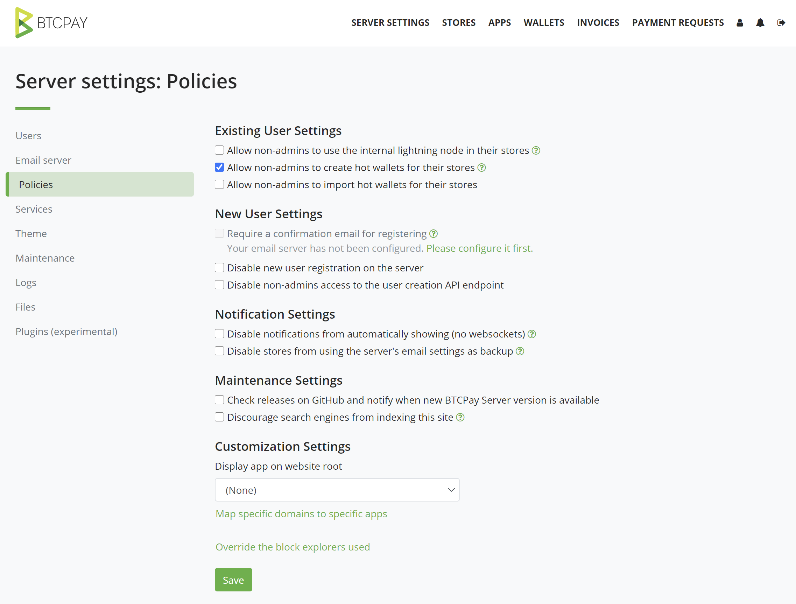
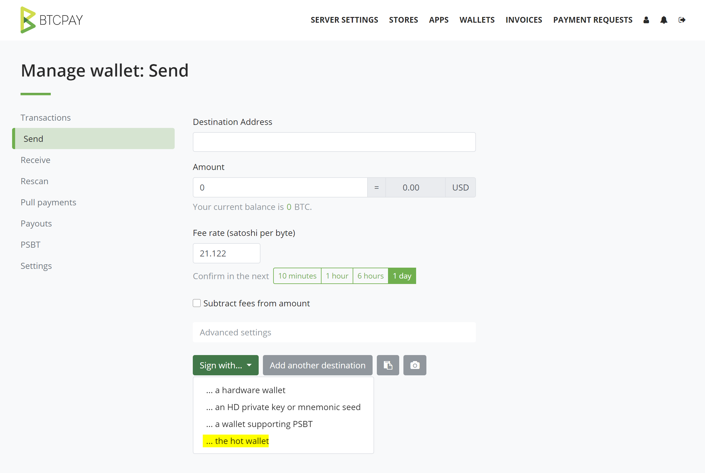

# BTCPay Hot Wallet

BTCPay Server also allows stores to **generate or import a wallet** while also storing its private keys.
This enables generating new wallets entirely within BTCPay, for features such as [Payjoin](./Payjoin.md) and [Liquid](https://github.com/btcpayserver/btcpayserver/issues/1282).

## Security Implications

Storing private keys on a public server comes with risks.
This is similar to the risks of running and using the [Lightning Network](./LightningNetwork.md) (except that you can recover funds with a backup).
**Please, ALWAYS be sure to back up any seed that is generated by this feature and to never leave money you cannot afford to lose spendable by those private keys**.

## Requirements for Hot Wallet

By default, you need to be a server admin to use the hot wallet feature.
This is because server admins are able to extract the private key easily.
If for some reason (such as allowing individuals that trust you enough with their store), you can enable the hot wallet for non-admins from Server Settings > Policies > "Allow non-admins to create hot wallets for their stores".

### Setting up your store

Setting up a **hot wallet** is quite easy.

1. Go to your BTCPay Server’s Store > Settings > Wallet > Setup
2. Create new wallet
3. Choose Hot Wallet
4. Choose the wallet's address format > Continue
5. You MUST backup this seed responsibly.
6. The public key will automatically be imported in the store.

### Spending funds with BTCPay Hot Wallet

Once you’ve received funds to your wallet and you decide to spend them, you can sign the transaction automatically, all inside BTCPay Server.

1. In BTCPay Server, go to > Wallets > Manage > Send
2. Fill in the Destination address and the Amount
3. Select Sign the hot wallet
4. Review the transaction
5. Broadcast the transaction

## Reducing risk

As mentioned above, the hot wallet functionality includes risk of funds being stolen in the case of the server or account being compromised.
To mitigate this risk, we advise you to:

* Enable two factor or U2F authentication
* Occasionally move funds to your cold storage either manually or by configuring [BTC Transmuter](https://github.com/btcpayserver/btcTransmuter/blob/master/README.md) with automatic payment forwarding.

:::danger
Do not give anyone else access to your server's SSH keys or server account credentials when using a hot wallet. Anyone with access to your account can spend the funds from your hot wallet. If you need to allow account access to employees, developers, etc. use an [xpub connected wallet](WalletSetup.md#use-an-existing-wallet) instead.
:::

## Importing seeds with an existing balance

You can also **import an existing seed** (then re-scan it to show the [current balance](./Wallet.md#re-scan)) but it is not recommended.
